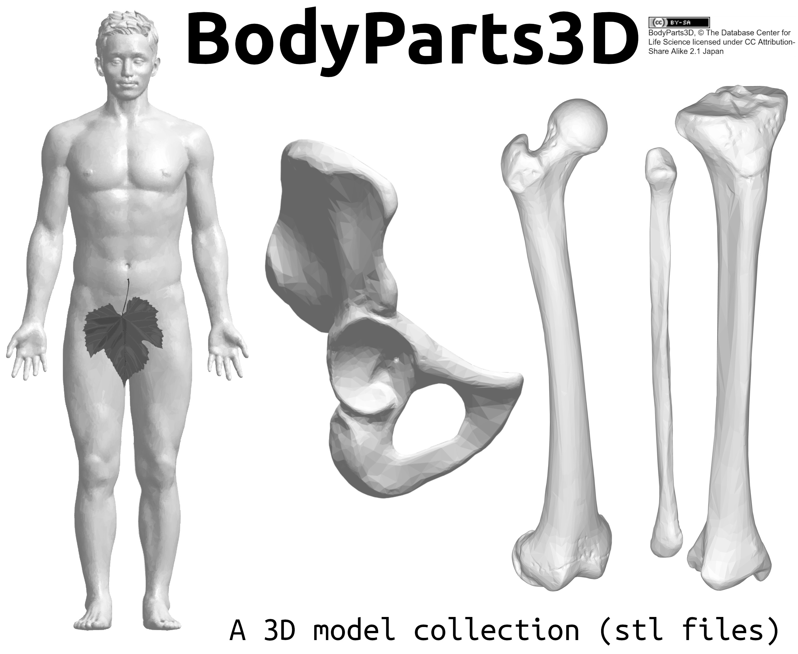

# BodyParts3D
This repository contains a collection of 3D models of human anatomy. The 3D models are STL files which have been converted from the original `.obj` files from the BodyParts3D/Anatomography project: http://lifesciencedb.jp/bp3d/.

## Getting started

* The stl files are contained in the `stl` folder.
* Most files are named using their **Foundational Model of Anatomy Ontology (FMA)** representation, which follows the format: FMA<_FMAID_>.stl.
* In an effort to create a humn-readable list to interogate the files, the csv file `FMA_ID_label_obj.csv` collects the _FMAID_ for each obj file as well as the `preferredName` from the ontology. An example from this list is provided here:

| `FMAID`      | `preferredName` |
| ----------- | ----------- |
| 7163   | Skin      |
| 16586   | Right hip bone      |
| 24474      | Right femur       |
| 24477      | Right tibia      |
| 24480   | Right fibula       |

* For more information search the original website: http://lifesciencedb.jp/bp3d/

## Contributing
Contributions are welcome! Please post issues and pull requests or email: kevin.moerman@nuigalway.ie.
Contributions are especially welcome in terms of creating improved "human-readable" lists of the anatomical components (since many are not familiar with the FMAID codes) to help guide retrieval of the 3D files from the database.

## License
This work is a clone (as permitted by the license) of the 3D files provided at http://lifesciencedb.jp/bp3d/. The files are licensed under the the following license:
_Creative Commons License Creative Commons Attribution-Inheritance 2.1 Japan (CC BY-SA)_

http://lifesciencedb.jp/bp3d/info_en/license/index.html

**BodyParts3D, Copyrightc 2008 Life Science Integrated Database Center licensed by CC Display-Inheritance 2.1 Japan**
